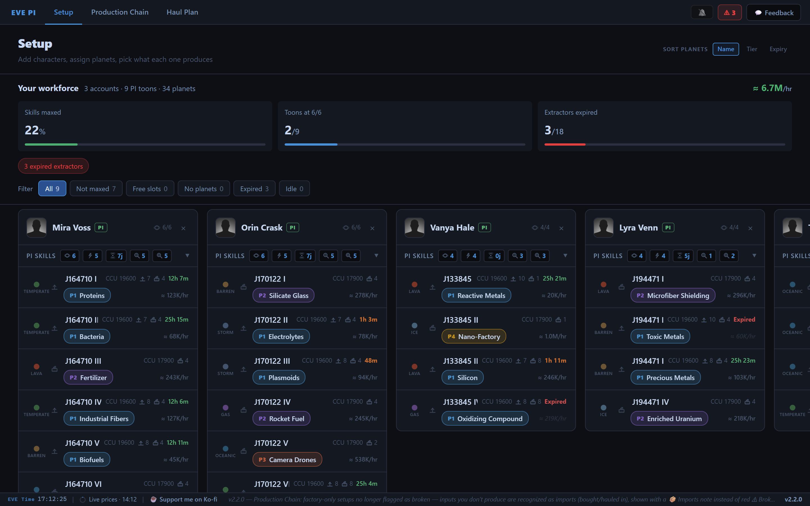
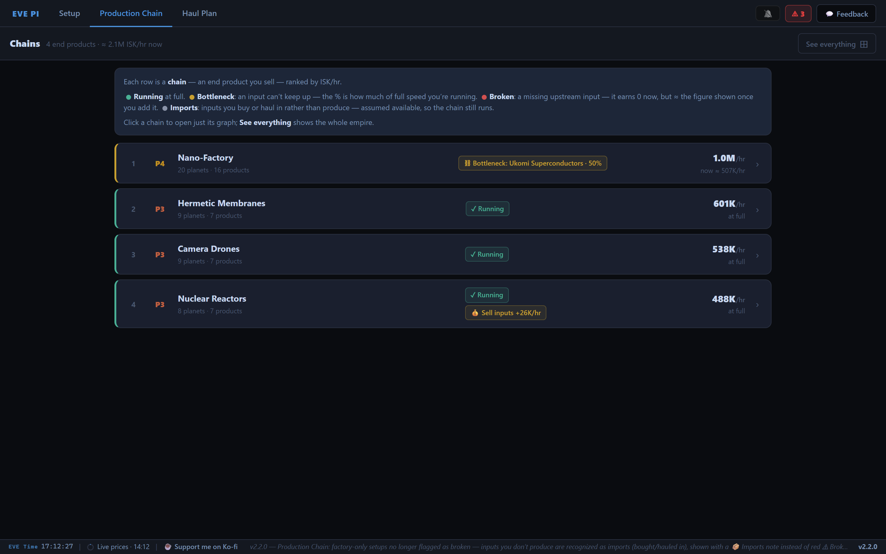
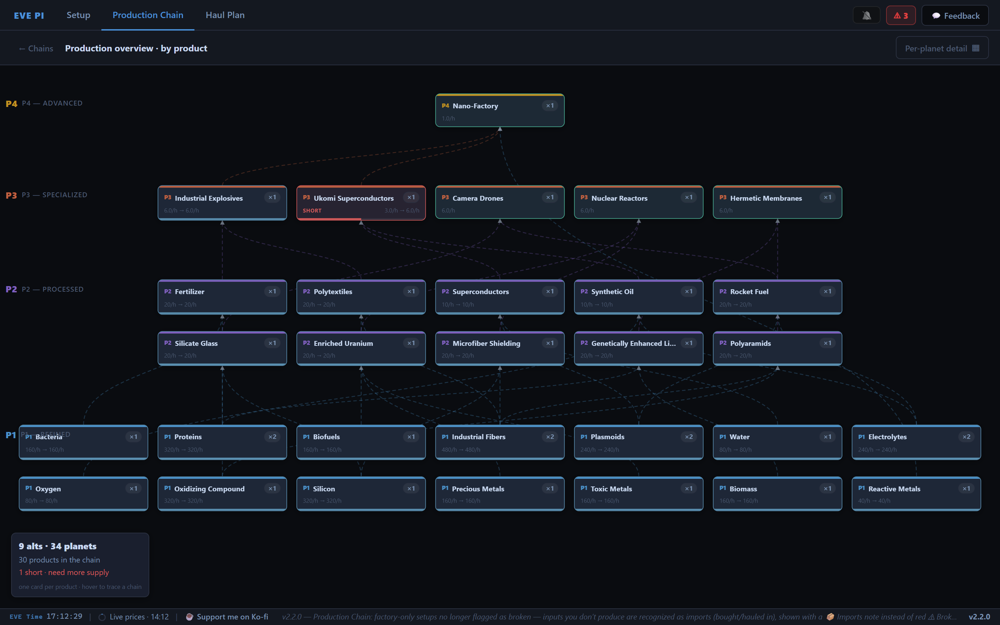
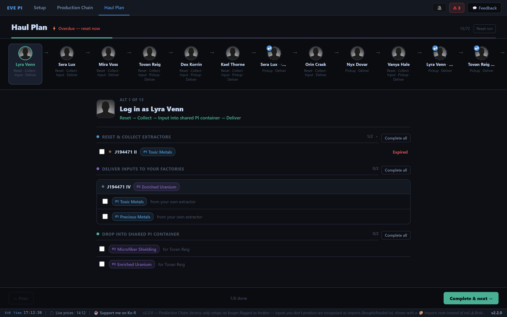

# 🪐 EVE PI Helper

Plan **Planetary Industry** across your whole stable of EVE Online characters —
the production chain, the profit, and the hauling — in one place.

**▶ Try it now: [eve-pi-helper.vercel.app](https://eve-pi-helper.vercel.app)** — free, no
install. Log in with EVE SSO and your colonies load automatically.

---

PI is deceptively deep. One character with six planets you can hold in your head.
A dozen alts feeding each other across a P0→P1→P2→P3→P4 web — each extractor on its
own timer, materials split between multiple factories — is a spreadsheet most people
never build, so most of the profit sits on the table.

EVE PI Helper turns that whole operation into something you can *see*, *reason about*,
and *execute* without a spreadsheet. Here's the tour.

## 1. Setup — your whole workforce at a glance

Import your characters and pick what each planet produces. The workforce bar up top
tallies your empire: total ISK/hr, how many alts have PI skills maxed, and how many
extractors have expired and need a reset. Filter to just the toons that need
attention — not maxed, free planet slots, extractors idle.

## 2. Production Chain — what's earning, what's broken

Every end product you sell, ranked by ISK/hr. Each row tells you at a glance whether
that chain is **running at full**, throttled by a **bottleneck** (an input that can't
keep up, with the % of full speed you're actually hitting), or **broken** (a missing
input earning you zero — and what it'd be worth once you add it).

Click any chain — or hit **See everything** — to open the graph: your empire laid out
as tiers from raw P1 materials at the bottom up to P4 at the top. Arrows show what
feeds what, and a starved input lights up red so you can trace the problem to its
source.

## 3. Haul Plan — one login at a time

The part that usually eats your evening. The haul plan walks you through your run
**one character at a time**, in an order that respects who feeds whom — including
return visits when an alt's input is produced by a *later* alt. For each login it
spells out exactly what to reset and collect, what to drop into the shared container,
and what to pick up and deliver. Materials feeding several factories are split by real
demand, so each alt grabs only its share. Tick things off as you go; the plan stays
put while you work.

## Also inside

- **Template search** — find any PI setup template and copy it to paste in-game.
- **Skill editor** — set your PI skills, or plan ahead with overrides, and watch the
  numbers update.
- **Extractor reminders** — an optional nudge when planets need a reset.

## Your data stays yours

Log in with EVE's official SSO. Your access tokens are held server-side in an
encrypted, httpOnly cookie — browser JavaScript never sees them. Your planet setup
lives only in your own browser; there's no database of player empires sitting on a
server somewhere.

---

☕ Like it? [Support it on Ko-fi.](https://ko-fi.com/Q5P7222HHS)

*Not affiliated with CCP Games. EVE Online is a trademark of CCP hf.*
